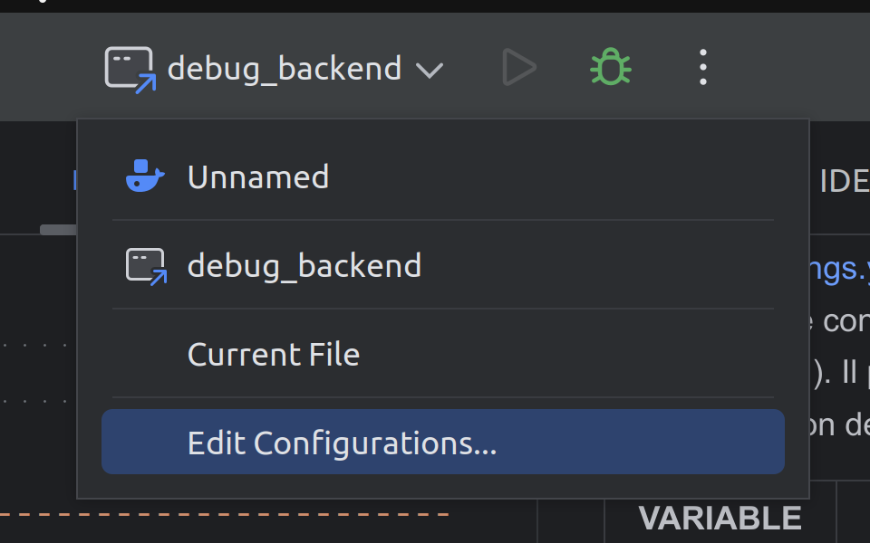
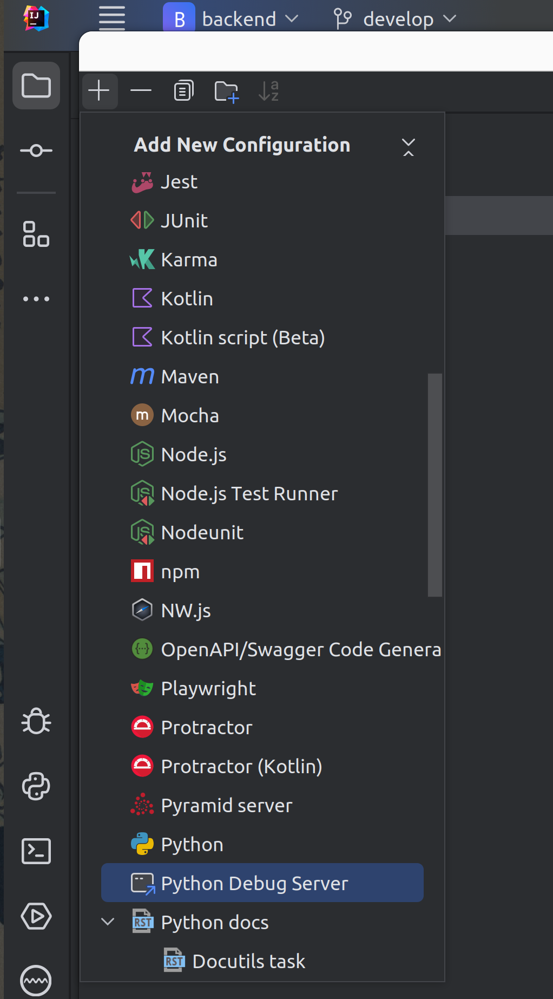
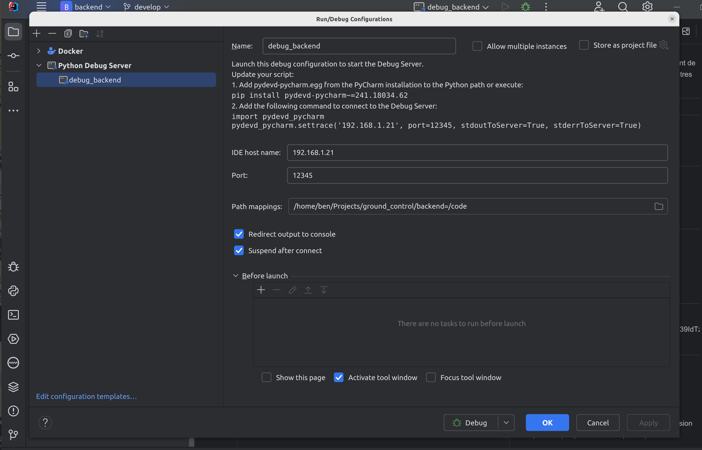
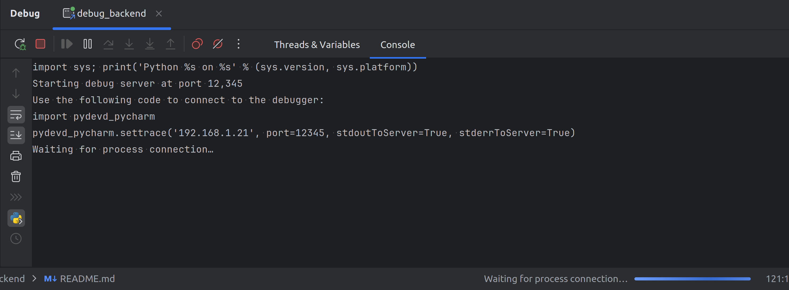
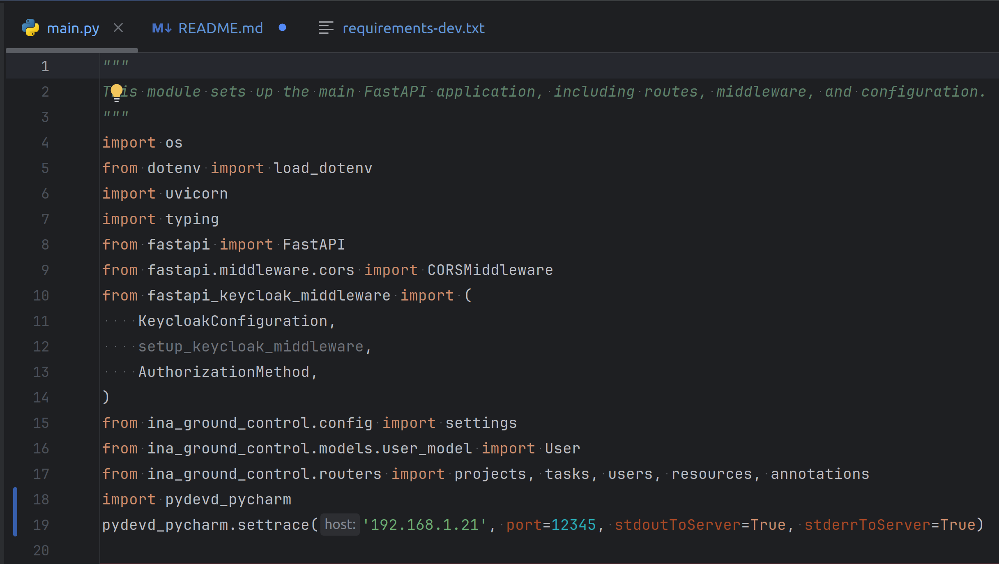

# Ground Control Backend


### Création du virtualenv

Si vous souhaitez lancer l'api sans le reste de la stack, exécutez les commandes suivantes depuis la racine de ce dépôt :

```bash
virtualenv venv
source venv/bin/activate
python -m pip install --upgrade pip
```

### Lancement avec docker compose

Sinon, créez un dossier pour le projet ground-control et récupérez les projets front et back :

```bash
mkdir ground-control
git clone https://git.infra.sas.ina/ia/code/ground-control/front.git
git clone https://git.infra.sas.ina/ia/code/ground-control/backend.git
cd ground-control/backend/.dev
docker-compose up -d
```

### Alembic

Pour générer un script de révision alembic après avoir modifié les fichiers models de l'application, se positionner dans le docker ou le virtual env et éxécuter : 

```bash
alembic revision --autogenerate -m "Add model changes"
```

Pour mettre à jour la base avec la dernière révision, éxécuter : 

```bash
alembic upgrade head
```

### Documentation

La documentation utilise  et  
Pour générer une nouvelle version de la doc, se placer dans le répertoire /docs et éxécuter : 

```bash
sphinx-build -E -b html . ./_build/
```

### Bug Possible

Pendant le developpement, il se peut que l'application Nuxt ne puisse plus se rafraîchir. Vous verrez alors dans le terminal du container ce genre d'erreur.


En attendant de trouver une solution, supprimer le container `dev-frontend-1` et le relancer suffit
```bash
docker rm dev-frontend-1
docker compose up -d
```

### Variables d'environnement :

Les variables d'environnement sont définies dans le fichier [.env.local](https://git.infra.sas.ina/ia/code/ground-control/backend/-/blob/develop/.env.local) et sont utilisées dans la definition de l'url de connexion à la base de données (DATABASE_URL)

| NOM               | EXEMPLE           | DESCRIPTION                                                         |
|-------------------|-------------------|---------------------------------------------------------------------|
| PG_SERVER         | postgresql        | serveur de base de donnée utilisé                                   | 
| PG_DATABASE       | ground_control_db | nom de la base de données                                           | 
| PG_USERNAME       | user              | nom d'utilisateur comme login pour se connecté à la base de données | 
| PG_PASSWORD       | postgres          | le mot de passe associé au login                                    |
| PG_PORT           | 5432              | numero de port de la base de données                                | 
| DATABASE_HOSTNAME | @db               | nom du domaine                                                      |

### Configuration SSO

Le fichier [settings.yaml](https://git.infra.sas.ina/ia/code/ground-control/backend/-/blob/develop/ina_ground_control/settings.yaml) permet de gerer les parametres de configuration (pour l'environnement de dev et du prod).
Il permet de stocker des paramètres de configuration de manière structurée et lisible.

| VARIABLE             | EXEMPLE                             | UTILITE                                                                          |
|----------------------|-------------------------------------|----------------------------------------------------------------------------------|
| url                  | "http://keycloak:9080/"             | L'URL de base pour le service SSO qui est Keycloak                               | 
| realm                | "ground-control"                    | le nom du lot defini dans keycloak qui gére le groupe d' utilisateurs            | 
| client_id            | "backend"                           | L'identifiant du client qui va se connecter à Keycloak (à definir dans keycloak) | 
| client_secret        | "S95Ja09NGqzB4UvXoUgbcM39IdTz8826"  | la clé secrete generer automatiquement avec keycloak                             |


### Utilisation du débugueur avec les IDE jetbrains

* Tout d'abord, mettre à jour l'IDE à la dernière version disponible. (Help > Check for updates)

* Ensuite, dans le menu déroulant des configurations disponibles, sélectionner "Edit Configurations" :



* Cliquer sur le bouton "+", et ajouter une configuration de type "Python debug server" : 



* Donner un nom à la configuration de debug,
* Choisir un port 
* Dans le champ "IDE host name", renseigner l'adresse ip où tourne l'IDE.
* Mapper le chemin du projet sur la machine avec le chemin dans le container. Par exemple :
  /home/ben/Projects/ground_control/backend=/code



* Il faut rebuild le container avec la version à jour du plugin **pydevd-pycharm**, telle qu'elle est indiquée dans la configuration du serveur de debug. Ainsi, dans le container, faire par exemple :

```
pip install pydevd-pycharm~=241.18034.62
```

Ou bien ajouter **pydevd-pycharm~=241.18034.62** au requirements-dev.txt, puis rebuild le container :

```
docker compose up -d --build backend
```

* Une fois le projet relancé, lancer la configuration debug nouvellement créée en cliquant sur l'icône de debug. On doit voir cet écran :



* Pour finir, recopier dans le fichier **main.py** juste après les imports les lignes indiquées dans la configuration de debug. Dans l'exemple :

```
import pydevd_pycharm
pydevd_pycharm.settrace('192.168.1.21', port=12345, stdoutToServer=True, stderrToServer=True)
```



* L'application va détecter un changement et, au reload, se connecter au debugueur. Si un warning apparait dans la console de debug au sujet d'un problème de version, faire simplement "resume program" (F9)

